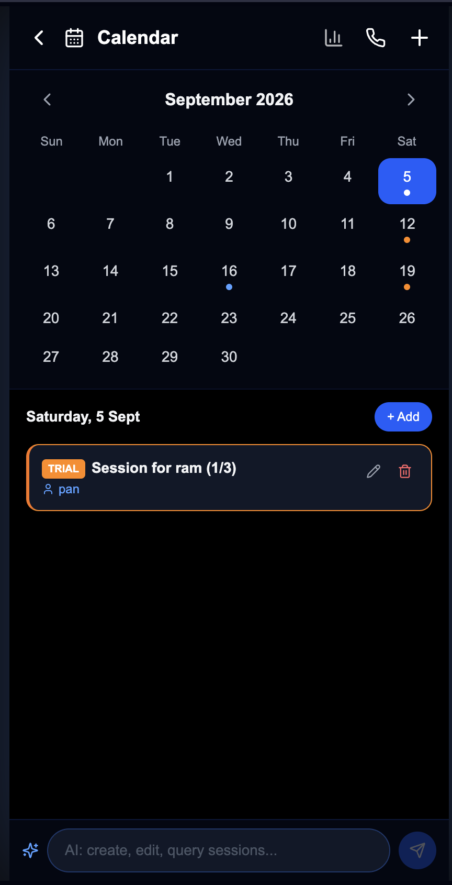
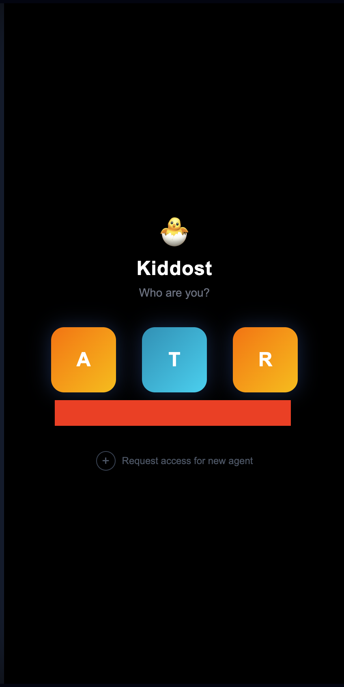

# KidDost AI & Business Operations Platform

This repository contains the complete source code for an AI-powered WhatsApp chatbot and agent dashboard backend. It was originally built to manage, scale, and automate customer interactions for my mother's business, KidDost.

## Vision and Future Plans

Small businesses—ranging from local grocery shops to clinics, hospitals, and service providers—are often overloaded with repetitive customer inquiries, wasting valuable time that could be spent on core operations. Existing automated solutions in the market are prohibitively expensive and overly complicated for the average business owner.

My plan is to launch this platform as a B2B SaaS company for small businesses at a highly affordable price point of **₹999 per month**. It is designed to be fully customizable to fit the specific needs and workflows of any business. It completely automates customer acquisition, FAQ handling, and booking processes, while seamlessly allowing business owners to step in when a human touch is required.

## Key Features

The platform is a comprehensive CRM and automated messaging system, encompassing both a Node.js backend and a frontend dashboard.

*   **Intelligent AI Automation**: Powered by GPT-4, the system uses strict playbooks and rules to answer FAQs, provide pricing, and guide customers toward booking. It handles context intelligently, parses attached media (like resumes), and strictly enforces business rules (like English-only responses or polite rejections).
*   **Seamless Manual Takeover**: Human agents can monitor conversations in real-time. If a complex query arises, the agent can instantly toggle the AI off, take over the chat, and send custom messages or media.
*   **Real-Time Agent Dashboard**: A dedicated interface for staff to monitor all active chats, view read/delivered receipts, and reply directly. 
*   **Quick Reply Templates**: Agents can inject predefined, variable-based templates (e.g., booking confirmations, slot availability) directly into the chat with a single click.
*   **Automated Booking Extraction & Calendar**: The AI extracts booking details (date, time, parent name) from the conversation and plots them onto an interactive calendar dashboard.
*   **Push Notifications**: Agents receive instant browser push notifications for new messages, session requests, or agent assignments.
*   **Robust Database Architecture**: Built on Supabase, automatically syncing contacts, archiving conversation histories, and storing media attachments securely.
*   **Multi-Agent Support**: Secure PIN-based login system for multiple agents with custom profiles and avatars.

## Screenshots

*Note: All customer names, phone numbers, and sensitive information in the following screenshots have been intentionally blurred to protect privacy.*

### Live Conversation View

### Agent Dashboard & Chat List

### Booking Calendar

### Agent Login

